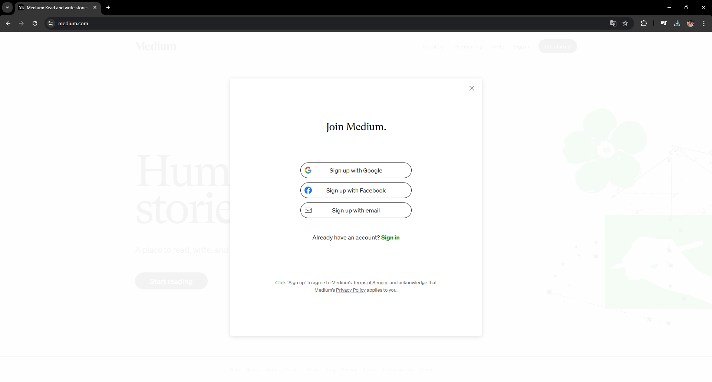
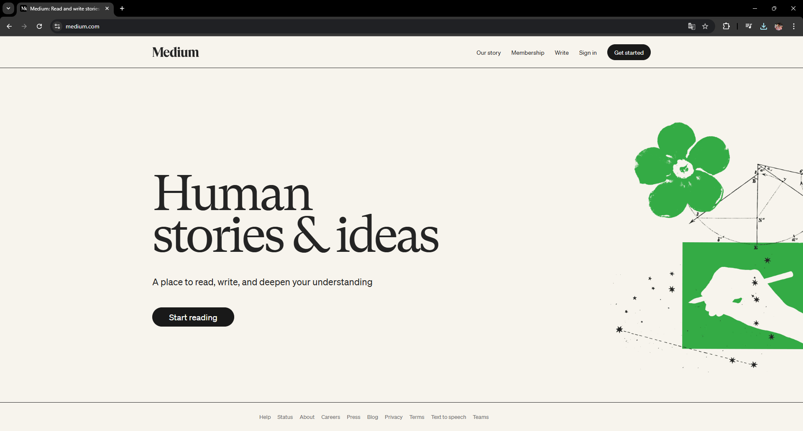

# Clone do Pinterest

## Objetivo
O objetivo deste projeto é construir uma réplica básica da tela de login e da tela home do Pinterest, utilizando ReactJS e Styled Components. 

## Funcionalidades

### 1. Tela de Login
- Campos obrigatórios: e-mail e senha.
- Um botão para simular o login.

### 2. Tela Home
- Cabeçalho que contém a logo do Pinterest e o nome do usuário.
- Seção para o feed que simula posts com informações como nome do usuário e texto da publicação.

### 3. Componentes e Estilos
- Utilização de Styled Components para manter o CSS encapsulado em cada componente.
- Criação de pelo menos dois componentes reutilizáveis.

## Tecnologias Utilizadas
- ReactJS
- Styled Components
- React Hooks

## Capturas de Tela
### Tela de Login


### Tela Home


## Conclusão
Este projeto demonstra como criar uma interface simples utilizando React e Styled Components, seguindo boas práticas de programação e organização de código. A réplica do Pinterest permite entender como criar componentes reutilizáveis e manter o estilo encapsulado, resultando em um código mais limpo e gerenciável.

## Instruções para Executar o Projeto
1. Clone o repositório:
   ```bash
   git clone https://github.com/eduardofmonteiro/oClone
